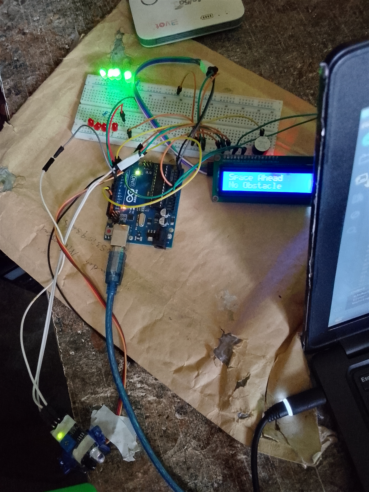

# Intelligent Proximity Alert System Project

This project is designed to monitor obstacles using an IR obstacle sensor. When an obstacle is detected, the system activates multiple alert mechanisms including LEDs, buzzer, servo motor movement, and LCD display notifications.

If an obstacle is detected:
- Red LED turns ON
- Buzzer activates
- Servo motor rotates left and right
- LCD displays an alert message

If no obstacle is detected:
- Green LED turns ON
- System remains calm
- LCD displays safe status message

This project can be used for:
- Smart security systems
- Obstacle monitoring
- Simple automation projects
- Arduino learning projects
- Mini robotics systems

## Components Used

- Arduino Uno/Nano
- IR Obstacle Sensor
- Servo Motor
- I2C LCD Display (16x2)
- Red LED
- Green LED
- Buzzer
- Jumper Wires
- Breadboard

## Circuit Connections

| Component | Arduino Pin |
|-----------|-------------|
| Green LED | D4 |
| Red LED | D3 |
| IR Sensor OUT | D6 |
| Servo Signal | D11 |
| Buzzer | D2 |
| LCD SDA | A4 |
| LCD SCL | A5 |

## Features

- Real-time obstacle detection
- Servo motor scanning movement
- LCD live status display
- Audio alert system
- Visual LED indicators
- Beginner-friendly Arduino code
- Lightweight embedded system project

## How It Works

1. The IR sensor continuously monitors for obstacles.
2. If no obstacle is detected:
   - Green LED turns ON
   - LCD displays safe message
3. If an obstacle is detected:
   - Red LED turns ON
   - Buzzer sounds
   - Servo motor rotates
   - LCD displays warning alert

## Project images

[Click Here For Other Images](images)

## Project Code
[Click Here For the Code](code/Intelligent_Proximity_Alert_System_project_on_16th_may_2026.ino)

## Project Demo Video
[Click Here for the Demonstration video on the Project](https://youtu.be/MvA31uv82MY?si=FGgKhPHqmRqTveKb)

## Challenges Faced

- Servo motor movement adjustment
- IR sensor calibration and stability
- Reducing false obstacle detection
- LCD timing optimization

## Learning Outcome

Through this project, I learned:
- Arduino sensor integration
- Servo motor control
- LCD interfacing
- Real-time embedded system response
- Hardware debugging and testing
- Embedded systems fundamentals
